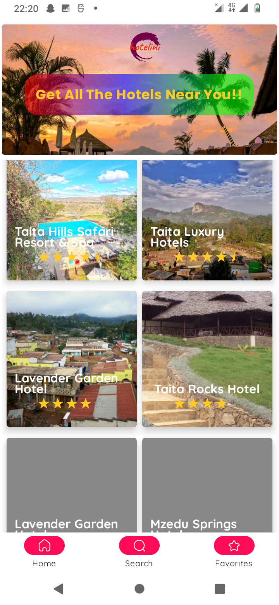

<p align="center"></p>

### HOTELINI APP 📱
Hotelini App is a Android Application built with koltin and jetpack compose that gives the user the nearest hotels near them. The app scans your locations gets your location then finds all the hotels near you and there details.

The app is also set to provide distance and directions from your location to the nearest hotel although this are features which are almost done and being added

The App consumes [Rapid API]("https://rapidapi.com/DataCrawler/api/tripadvisor16/playground/apiendpoint_6c187918-f989-4c63-bf1e-b2e38efe3152") to display the hotels 
built with Jetpack Compose, MVVM ,MVI pattern as well as Architecture Components.

### 💡 Note
if you happen to fork this project please make sure to keep your fork in syc since a lot of changes are always being added everyday

### 🔑 Permissions Required
The app requires the following permissions to run:

    ACCESS_COARSE_LOCATION
    INTERNET
    ACCESS_FINE_LOCATION
    CALL_PHONE

### Screenshots
These are the app's screenshots:





### Structural design pattern
The app is built with the Model-View-ViewModel (MVVM) is its structural design pattern that separates objects into three distinct groups:
- Models hold application data. They’re usually structs or simple classes.
- Views display visual elements and controls on the screen. They’re typically subclasses of UIView.
- View models transform model information into values that can be displayed on a view. They’re usually classes, so they can be passed around as references.

## 🛠 Tech/framework used
**Built with**
- [Kotlin](https://kotlinlang.org/)
- [JetPack Compose](https://developer.android.com/jetpack/compose)
- [Rapid API](https://rapidapi.com/DataCrawler/api/tripadvisor16/playground/apiendpoint_6c187918-f989-4c63-bf1e-b2e38efe3152)
- [Google Maps API](https://developers.google.com/maps/documentation)

## 🛠 Installation & Set Up
MAPS API KEY is required to run the app. The API key can be obtained from the Google Cloud Platform. The API key should be added to the `AndroidManifest.xml` file.
Also to proceed to [Rapid API]("https://rapidapi.com") and create your API key

Example of `local.properties` file:
```
## This file is automatically generated by Android Studio.
# Do not modify this file -- YOUR CHANGES WILL BE ERASED!
#
# This file should *NOT* be checked into Version Control Systems,
# as it contains information specific to your local configuration.
#
# Location of the SDK. This is only used by Gradle.
# For customization when using a Version Control System, please read the
# header note.
sdk.dir=/home/lynne/Android/Sdk
MAPS_API_KEY=ABCDEF
RAPID_KEY=ABCDEF1234567890
```
## Tech Stack.
- [Kotlin](https://developer.android.com/kotlin) - Kotlin is a programming language that can run on JVM. Google has announced Kotlin as one of its officially supported programming languages in Android Studio; and the Android community is migrating at a pace from Java to Kotlin.
- Jetpack components:
    - [Jetpack Compose](https://developer.android.com/jetpack/compose) - Jetpack Compose is Android’s modern toolkit for building native UI. It simplifies and accelerates UI development on Android. Quickly bring your app to life with less code, powerful tools, and intuitive Kotlin APIs.
    - [Android KTX](https://developer.android.com/kotlin/ktx.html) - Android KTX is a set of Kotlin extensions that are included with Android Jetpack and other Android libraries. KTX extensions provide concise, idiomatic Kotlin to Jetpack, Android platform, and other APIs.
    - [AndroidX](https://developer.android.com/jetpack/androidx) - Major improvement to the original Android [Support Library](https://developer.android.com/topic/libraries/support-library/index), which is no longer maintained.
    - [Lifecycle](https://developer.android.com/topic/libraries/architecture/lifecycle) - Lifecycle-aware components perform actions in response to a change in the lifecycle status of another component, such as activities and fragments. These components help you produce better-organized, and often lighter-weight code, that is easier to maintain.
    - [ViewModel](https://developer.android.com/topic/libraries/architecture/viewmodel) -The ViewModel class is designed to store and manage UI-related data in a lifecycle conscious way.
    - [Paging 3 library](https://developer.android.com/topic/libraries/architecture/paging/v3-overview) - The Paging library helps you load and display pages of data from a larger dataset from local storage or over network. This approach allows your app to use both network bandwidth and system resources more efficiently.
- [Kotlin Coroutines](https://developer.android.com/kotlin/coroutines) - A concurrency design pattern that you can use on Android to simplify code that executes asynchronously.
- [Retrofit](https://square.github.io/retrofit) -  Retrofit is a REST client for Java/ Kotlin and Android by Square inc under Apache 2.0 license. Its a simple network library that is used for network transactions. By using this library we can seamlessly capture JSON response from web service/web API.
- [GSON](https://github.com/square/gson) - JSON Parser,used to parse requests on the data layer for Entities and understands Kotlin non-nullable and default parameters.
- [Kotlin Flow](https://developer.android.com/kotlin/flow) - In coroutines, a flow is a type that can emit multiple values sequentially, as opposed to suspend functions that return only a single value.
- [Dagger Hilt](https://developer.android.com/training/dependency-injection/hilt-android) - A dependency injection library for Android that reduces the boilerplate of doing manual dependency injection in your project.
- [Ramcosta Navigation Library](https://composedestinations.rafaelcosta.xyz/) - A KSP library that processes annotations and generates code that uses Official Jetpack Compose Navigation under the hood. It hides the complex, non-type-safe and boilerplate code you would have to write otherwise.
- [Coil](https://coil-kt.github.io/coil/compose/)- An image loading library for Android backed by Kotlin Coroutines.
- [Timber](https://github.com/JakeWharton/timber)- A logger with a small, extensible API which provides utility on top of Android's normal Log class.


## 📝 License
This project is licensed under Apache License 2.0 - see the LICENSE file for details.

